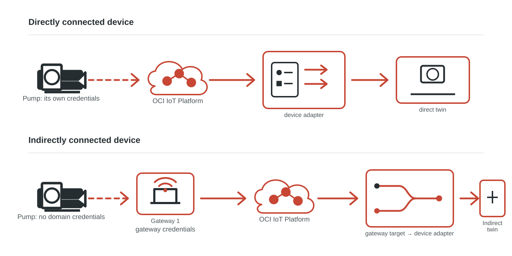
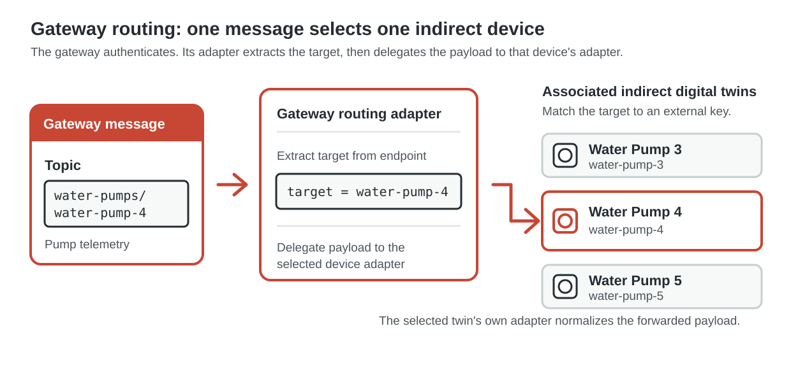

# Lab 1: Understand Gateways and Indirectly Connected Devices

## Introduction

Before you configure Gateway 1, compare the two OCI IoT Platform connectivity patterns. A directly connected digital twin authenticates to the IoT domain and sends its own telemetry. An indirectly connected digital twin does not authenticate to the domain. Instead, it is associated with one or more gateways, and the authenticated gateway forwards its telemetry to OCI IoT Platform.

Estimated Time: 10 minutes

```quiz-config
badge: images/gateway-understanding-badge.svg
```

### Objectives

In this lab, you will:

- Distinguish direct connectivity from gateway-based indirect connectivity.
- Identify the gateway, target device, and adapter responsibilities in the indirect path.
- Check your understanding before you create the gateway configuration.

### Prerequisites

- Complete the workshop introduction.

## Task 1: Compare direct and indirect connectivity

1. Review the topology. Both paths can update a digital twin in OCI IoT Platform. The difference is where the domain-facing authentication and device routing occur.

    

2. In the **direct** path, the device connects to the IoT domain with its own authentication ID and external key. Its adapter maps telemetry, when mapping is required, before the service updates that device's digital twin instance.

3. In the **indirect** path, the gateway is the domain-facing device. It authenticates to OCI IoT Platform and forwards data from one or more associated indirect devices. An indirect device is associated with a gateway instead of having its own authentication ID.

    A gateway, like a directly connected device, requires an authentication ID. You can use either a Vault secret or an mTLS certificate. Certificates are recommended for production deployments.

4. The gateway adapter resolves the incoming message target before its routes are evaluated. When the target resolves to an associated indirect device external key, OCI IoT Platform delegates the payload to that device's adapter. When the target is empty or null, the message is gateway data instead. This is why Lab 2 creates both a gateway model and routing adapter before Lab 3 creates the pump instances.

    

5. In this workshop, the topic segment after `water-pumps/` identifies the target pump. Gateway health telemetry uses `data`, so it remains with Gateway 1. The two water pumps can use different adapters because, after routing, each target twin normalizes its own payload shape.

## Task 2: Check your understanding

1. Answer each question, then review its explanation.

    ```quiz
    Q: Which component authenticates to OCI IoT Platform for telemetry from an indirectly connected water pump?
    - The indirectly connected pump, using its own authentication ID
    * The gateway that is associated with the pump
    - The WaterPump model
    - The pump's digital twin adapter
    > An indirect device is associated with one or more gateways rather than given its own authentication ID. The gateway is the domain-facing device that forwards its telemetry.

    Q: Which authentication mechanisms can an OCI IoT gateway use?
    * A Vault secret or an mTLS certificate; certificates are recommended for production.
    - Only a Vault secret because certificates are for directly connected devices.
    - Only an mTLS certificate because gateways cannot use secrets.
    - Credentials from each indirectly connected device.
    > A gateway can use either a Vault secret or an mTLS certificate for its authentication ID. Certificates are the recommended option for production deployments.

    Q: What does the gateway adapter target determine for a forwarded message?
    - Which gateway certificate OCI uses for the MQTT connection
    - Which WaterPump model definition is deleted after processing
    * Which associated indirect device should receive the payload for its adapter to process
    - Whether the device must change to direct connectivity
    > The gateway resolves a target before routes run. When it resolves to an associated indirect device external key, OCI IoT Platform delegates the payload to that device's adapter.

    Q: Why can the two indirect pumps in this workshop use different adapters?
    - A gateway can authenticate only one indirect device at a time
    - Each adapter creates a separate IoT domain
    * After the gateway routes a message to a target pump, that pump's adapter can normalize its particular payload shape
    - An indirectly connected device cannot use the same model as another device
    > Gateway routing selects the target device. The selected device's adapter then maps its incoming payload to the shared WaterPump model, allowing different source formats.
    ```

    You may now **proceed to the next lab**.

## Learn More

- [Gateway and indirect-device scenario](https://docs.oracle.com/en-us/iaas/Content/internet-of-things/gateway-instance.htm)
- [Creating a digital twin instance](https://docs.oracle.com/en-us/iaas/Content/internet-of-things/create-digital-twin-instance.htm)
- [Digital twin adapters](https://docs.oracle.com/en-us/iaas/Content/internet-of-things/digital-twin-adapters.htm)

## Acknowledgements

* **Author** - Pete St. Pierre, Director, Product Management
* **Last Updated By/Date** - Pete St. Pierre, September 2026
